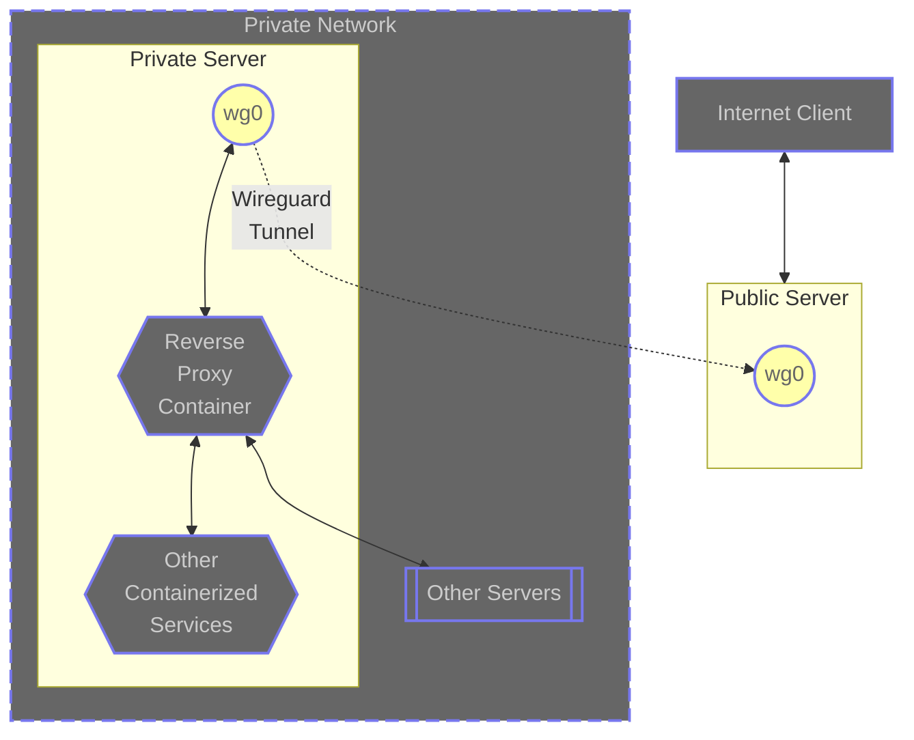

- Setup container host (private)
  - Install OS
  - Firewall
    - open ssh
    - open app ports (if wanting to access internally)
  - Install Wireguard
  - Configure WG
    - Generate WG keys
    - Copy VPS public key
  - Enable WG Service
  - Start WG Service
- Setup VPS (public)
  - Install OS
  - Firewall
    - open ssh
    - open wireguard (i.e. - 51820)
    - open app ports
  - Install Wireguard
  - Configure WG
    - Generate WG keys
    - Copy container host public key
    - Setup create/remove iptables forwards for each port (in PreUp/PostDown clauses)
    - Setup activate/deactivate iptables masquerading (in PreUp/PostDown clauses)
  - Enable WG Service
  - Start WG Service


### On private server
#### Shell commands:
```shell
[root@infra-test ~]# hostnamectl set-hostname infra-test
[root@infra-test ~]# dnf install wireguard-tools
[root@infra-test ~]# umask 077 && printf "[Interface]\nPrivateKey = " | sudo tee /etc/wireguard/wg0.conf > /dev/null
[root@infra-test ~]# sudo wg genkey | sudo tee -a /etc/wireguard/wg0.conf | wg pubkey | sudo tee /etc/wireguard/publickey
[root@infra-test ~]# vi /etc/wireguard/wg0.conf
[root@infra-test ~]# systemctl start wg-quick@wg0
[root@infra-test ~]# ping 10.9.8.1
[root@infra-test ~]# systemctl enable wg-quick@wg0
```
#### in `/etc/wireguard/wg0.conf`
```
[Interface]
PrivateKey = +PK2Nx8S/5KSuHhPRTLhyyoTQ+5/FDZuDPED8x2btFs=
Address = 10.9.8.2/24

[Peer]
PublicKey = MlTBm89jiVG13QdCcS6yr/KkeKMJw3JVKcgRNuomU1U=
AllowedIPs = 10.9.8.0/24
Endpoint = 192.168.50.80:51820
PersistentKeepalive = 25
```

### On public server:
#### Shell commands:
```shell
[root@gaming-test ~]# hostnamectl set-hostname gaming-test
[root@gaming-test ~]# dnf install wireguard-tools
[root@gaming-test ~]# umask 077 && printf "[Interface]\nPrivateKey = " | sudo tee /etc/wireguard/wg0.conf > /dev/null
[root@gaming-test ~]# sudo wg genkey | sudo tee -a /etc/wireguard/wg0.conf | wg pubkey | sudo tee /etc/wireguard/publickey
[root@gaming-test ~]# vi /etc/wireguard/wg0.conf
[root@gaming-test ~]# systemctl start wg-quick@wg0
[root@gaming-test ~]# firewall-cmd --add-port=51820/udp --permanent
[root@gaming-test ~]# firewall-cmd --reload
[root@gaming-test ~]# ping 10.9.8.2
[root@gaming-test ~]# wg syncconf wg0 <(wg-quick strip wg0)
[root@gaming-test ~]# wg
[root@gaming-test ~]# systemctl enable wg-quick@wg0
```
#### in `/etc/wireguard/wg0.conf`
```
[Interface]
PrivateKey = mKGa9VLa8J2/VNuSLEIuwY2/wdLw4Z2qn2rhdtCvC18=
ListenPort = 51820
Address = 10.9.8.1/24

[Peer]
PublicKey = dqcNZBA2gEU9e0n4J9zfzXqwQemcw0QR6JM+bu1RKG0=
AllowedIPS = 10.9.8.2/32
```
